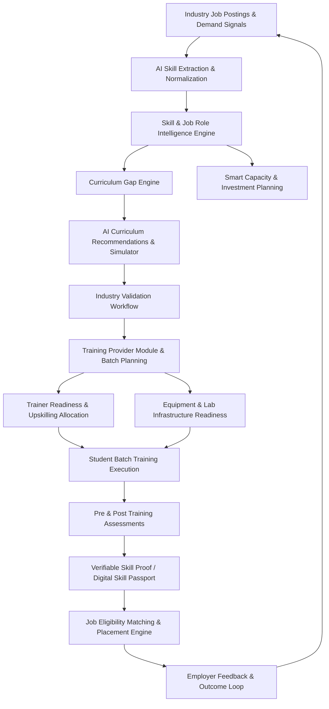
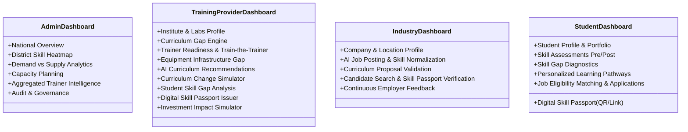

# System Architecture: Smart Skill Intelligence & Training Alignment Platform
**Problem Statement ID:** 26134 (Smart India Hackathon 2026)  
**System Name:** Smart Skill Intelligence & Training Alignment Platform (SSITAP)

---

## 1. High-Level Architectural Vision

The platform addresses the structural mismatch between rapid industry transformation and training delivery. It establishes a real-time, closed-loop feedback pipeline connecting **Industry Demand**, **Curricula**, **Training Providers**, **Trainers**, **Equipment**, **Students**, **Skill Assessments & Verifications**, **Placements**, and **Continuous Industry Feedback**.

---

## 2. Architectural Layers

### 2.1 Presentation Layer (Frontend)
- **Framework:** React 18+ with TypeScript and Vite.
- **Styling & UI Kit:** Tailwind CSS with modern Government-tech / Enterprise SaaS design language (custom card components, modal dialogs, drawers, badges, and accessible data tables).
- **Visualization & Maps:**
  - **Apache ECharts:** High-performance radar charts, time-series forecasts, multi-bar gap comparisons, capacity simulations, and sankey diagrams.
  - **Leaflet + OpenStreetMap:** District skill heatmaps, regional capacity clusters, and geographical supply-demand filters.
- **State & Data Management:** TanStack Query (React Query) for caching and background synchronization, React Router for role-scoped navigation, React Hook Form + Zod for schema-validated forms.

### 2.2 API & Gateway Layer
- **Framework:** Python FastAPI (asynchronous ASGI).
- **Security & Authorization:**
  - JWT Bearer Tokens with Role-Based Access Control (RBAC).
  - Scope guards for the 4 primary roles: `ADMIN`, `TRAINING_PROVIDER`, `INDUSTRY`, `STUDENT`.
  - **Strict Constraint:** Trainers are managed entities under Training Providers—there is **NO** independent Trainer role, dashboard, or login endpoint.
- **Documentation:** Interactive OpenAPI/Swagger documentation (`/docs`, `/redoc`).

### 2.3 Business Logic & Service Layer
- **Core Domain Services:**
  1. `AuthService`: Authentication, registration, token issuance, and organization association.
  2. `SkillIntelligenceService`: Skill taxonomy, category hierarchies, normalization, and demand metrics.
  3. `CurriculumGapService`: Mathematical comparison of required skills vs. curriculum modules, calculating alignment scores and severity.
  4. `CurriculumSimulatorService`: Real-time impact simulation for adding, replacing, or deprecating curriculum modules.
  5. `TrainerReadinessService`: Institute-scoped trainer profile, skill coverage, gap diagnosis, and Train-the-Trainer recommendations.
  6. `EquipmentGapService`: Equipment requirement checks, lab utilization, and deficit analysis.
  7. `SkillProofService`: Cryptographically verifiable digital skill proofs and tamper-evident Skill Passports.
  8. `JobMatchingService`: Multi-factor candidate eligibility scoring against job postings.
  9. `ForecastingService`: Historical analysis and predictive forecasting for skills, job roles, and capacity.
  10. `InvestmentSimulatorService`: ROI and capacity modeling for capital investments.
  11. `FeedbackLoopService`: Multi-stakeholder feedback ingestion triggering continuous recalculation of demand weights.

### 2.4 AI & Analytics Layer
- **NLP & Embeddings:** Hugging Face sentence-transformers (`all-MiniLM-L6-v2`) for semantic skill similarity and normalization, spaCy/regex for job description entity extraction.
- **Predictive Analytics:** scikit-learn / time-series regression for demand forecasting.
- **Resilient Fallback Engine:** A deterministic rule-based and pre-computed embedding provider ensures zero downtime and rapid demonstration even without heavy GPU runtimes.

### 2.5 Data Persistence Layer
- **Relational Storage:** PostgreSQL with `pgvector` extension for vector similarity searches (with SQLite fallback for lightweight local verification).
- **Caching & Async Queues:** Redis for session caches and background forecasting/reports.

---

## 3. Four Core Role Workflows

---

## 4. Non-Functional Requirements & Security
1. **Multi-Tenancy & Data Isolation:** Training Providers can only mutate and inspect their own trainers, batches, equipment, and students.
2. **Audit Logging:** Every curriculum modification, validation, and skill proof issuance records timestamped audit logs.
3. **Report Generation:** On-demand export of gap analyses, capacity plans, and passports into CSV, Excel, and printable PDF formats.
