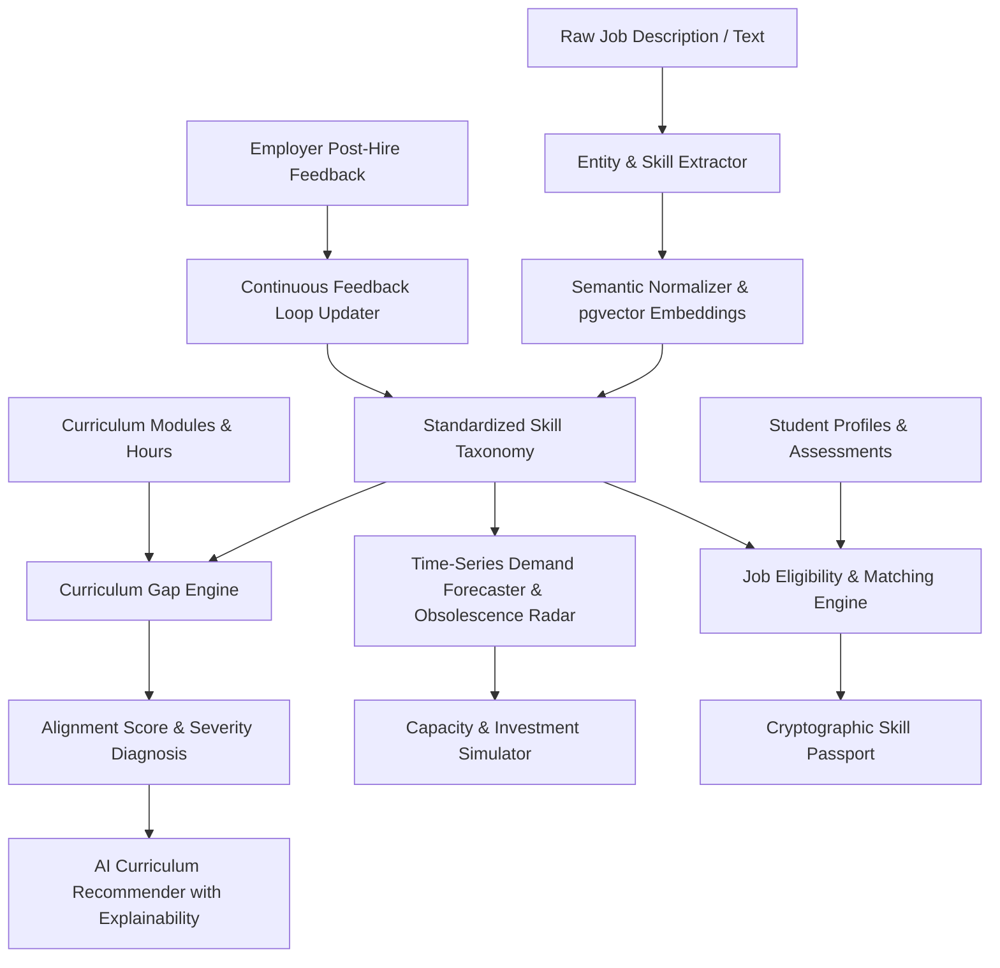

# AI & Analytics Architecture: Smart Skill Intelligence Platform

## 1. Architectural Philosophy
The AI engine is built with a **modular, privacy-first, and zero-cost open-source foundation**. It avoids brittle dependencies on expensive third-party APIs by using lightweight, high-performance open-source models paired with an embedded deterministic fallback engine.

---

## 2. Core AI Subsystems & Algorithms

### 2.1 Skill Extraction & Normalization Engine
- **Extraction:** Combines regex phrase patterns with transformer-based sequence tagging to extract skills, required toolsets, minimum experience, and education levels from free-form job descriptions.
- **Normalization & Embeddings:**
  - Standardizes surface variants (e.g., *"AWS"*, *"Amazon Web Services"*, *"AWS Cloud Computing"* $\rightarrow$ `Amazon Web Services`).
  - Utilizes `sentence-transformers/all-MiniLM-L6-v2` (384-dimensional dense vectors) to compute cosine similarity against the master skill taxonomy.
  - When vector similarity score exceeds threshold $\theta \ge 0.82$, canonical mapping is established automatically.
  - For offline/lightweight environments, a tokenized Jaccard/Levenshtein hash map provides instantaneous, zero-latency normalization.

### 2.2 Curriculum Alignment Score Algorithm
The **Curriculum Alignment Score** $A(C, D)$ compares the industry-required skill distribution $D$ against the curriculum offering $C$:

$$A(C, D) = \sum_{i=1}^{N} w_i \cdot \min\left(1.0, \frac{\text{Coverage}(s_i) \cdot \text{ProficiencyTarget}(s_i)}{\text{RequiredProficiency}(s_i)}\right) \times 100$$

Where:
- $w_i$ is the normalized industry demand weight for skill $s_i$ ($\sum w_i = 1$).
- $\text{Coverage}(s_i)$ is the ratio of instructional & practical hours dedicated to skill $s_i$ relative to the standard benchmark.
- **Gap Severity:**
  - $\text{Gap} < 15\%$: *Aligned / Low*
  - $15\% \le \text{Gap} < 35\%$: *Moderate*
  - $35\% \le \text{Gap} < 60\%$: *Severe Deficit*
  - $\text{Gap} \ge 60\%$: *Critical Missing Competency*

### 2.3 Curriculum Change Simulator Engine
The simulator enables technical directors to test hypothetical curriculum modifications without altering live courses:
- **Inputs:** Base curriculum, proposed module additions (skills, theory hours, practical hours), and modules to retire/deprecate.
- **Computation:**
  1. Recalculates effective coverage vector $C'$.
  2. Evaluates new alignment score $A(C', D)$.
  3. Estimates additional trainer qualification requirements: identifies if existing institute trainers possess the new skills.
  4. Estimates additional lab equipment requirements: flags required machinery units and capital expenditure.
- **Output:** Multi-option comparison delta ($\Delta A$, extra hours, cost estimate, trainer readiness delta).

### 2.4 Trainer Readiness & Upskilling Recommender
Because trainers are managed internally by Training Providers:
- Evaluates institute trainer proficiency vector against emerging industry skills.
- Flags trainer deficits when:
  $$\text{Proficiency}(\text{Trainer}, s) < \text{Target}(\text{Curriculum}, s)$$
- Generates targeted **Train-the-Trainer (TTT)** action plans, identifying exact government/industry certification programs needed.

### 2.5 Job Eligibility & Matching Algorithm
Matches candidate skill portfolios against active employer vacancies:
- **Direct Match:** Exact overlap on mandatory skills with $\text{CandidateProficiency} \ge \text{RequiredProficiency}$.
- **Semantic Overlap:** Evaluates conceptual adjacency for secondary skills using the taxonomy vector space.
- **Eligibility Classes:**
  - **Eligible** ($\ge 80\%$ match, zero mandatory skill deficits)
  - **Partially Eligible** ($50\% - 79\%$ match, actionable upskilling path generated)
  - **Not Eligible** ($< 50\%$ match)

### 2.6 Demand Forecasting & Obsolescence Radar
- Evaluates longitudinal quarterly hiring data across 5 distinct timeframes: $T-2, T-1, T_{\text{current}}, T+1, T+2$.
- Categorizes skills into actionable lifecycle stages:
  - **EMERGING** (Growth rate $> +40\%$, low current workforce supply) $\rightarrow$ *Action: ADD MODULE*
  - **HIGH GROWTH** (Growth rate $+15\%$ to $+40\%$) $\rightarrow$ *Action: EXPAND SEATS*
  - **STABLE** (Growth rate $-5\%$ to $+15\%$) $\rightarrow$ *Action: MAINTAIN*
  - **DECLINING / OBSOLETE** (Growth rate $< -20\%$) $\rightarrow$ *Action: REDUCE / RETIRE*

### 2.7 Verifiable Skill Proof (Digital Skill Passport)
- Produces a tamper-evident cryptographic hash combining:
  `SHA256(student_id + skill_id + proficiency + provider_id + assessor_signature + timestamp)`
- Embedded within a QR code and public URI for zero-friction verification by employers and external audit agencies.

### 2.8 Continuous Closed-Loop Feedback Ingestion
When employers rate newly placed graduates:
1. Low ratings in specific competencies dynamically increase the "reported skill deficit" penalty in the curriculum gap engine.
2. High employer satisfaction validates and reinforces curriculum weights.
3. Provides an autonomous self-healing training ecosystem.
